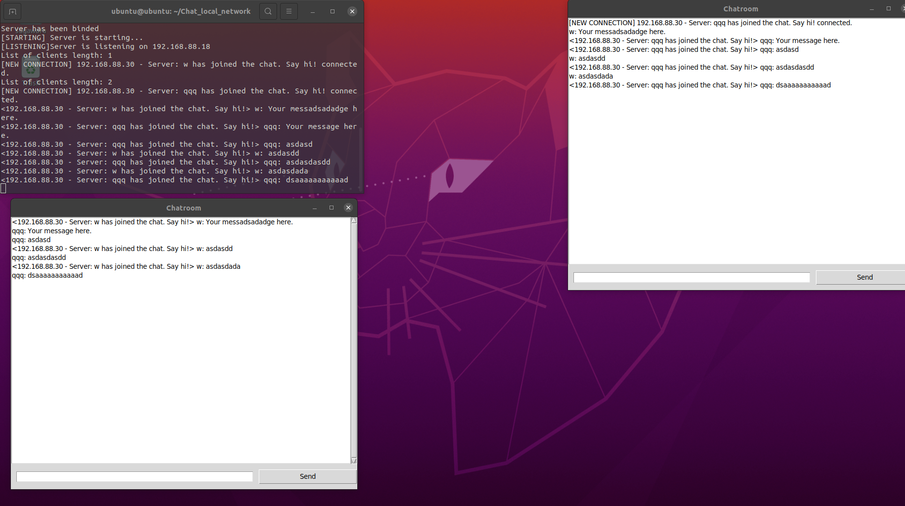

# Chat_local_network

### Какие библиотеки нужны

> socket
* pip install sockets
> threading
* pip install threaded
> sys
* pip install os-sys
> select
* pip install selection

### Запуск
Сначала запустите server.py, он вам выдаст ip и порт на каком он находиться.
Дальше на другом пк запустите client.py и введите ip и порт сервера.
Если хотите запустить чат с графическим интерфейсом, то выполните эту команду.
> python client_gui.py "ip - server (без кавычек)" -p "порт сервера(без кавычек)"
* python server.py
* python client.py

### Функционал
Чат внутри локальной сети.
1. Просмотр сколько клиентов в чате.
2. Логи на стороне сервера (Не знаю может лучше в log.txt)
3. Поддержка разных языков (RU, EN)
4. Логи сервера

### Что это?
Программа для чата по локальной сети. Можно применять на соревнованиях. Очень интересно было над ним работать.

### Пример работы

